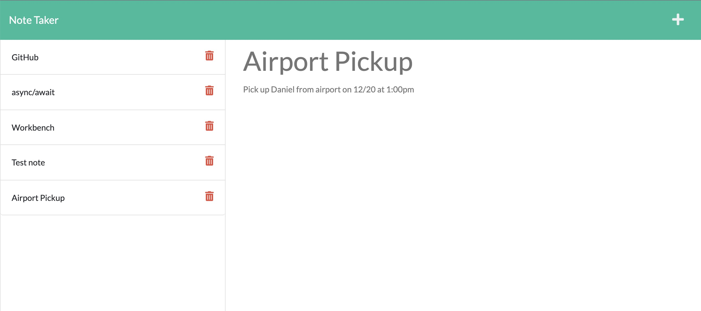

  Express Note Taker 

## Description

In this I used the basic structure provided on the HTML and CSS in the "public" folder and connected it with routes on the back end that can be used to save and retrieve data from a JSON file.

## Table of Contents

- [Installation](#installation)
- [Usage](#usage)
- [Repository-Link](#repository-link)
- [Media](#media)
- [Questions](#questions)
- [License](#license)

## Installation

Once you have the repo downloaded type in "node server.js" in the command line. Then go to htt://localhost:3001 to see the deployed site.

## Usage

When on the website write a note and note-title. Then, go to the top right and click save. This will save your note on the left column.

## Repository-Link

[Github Repo Link](https://github.com/mattgrogandev/ExpressJS-Note-Taker)

## Media

## Questions

If you have any questions regarding this project please contact either on GitHub or by Email below.

GitHub: [mattgrogandev](https://github.com/mattgrogandev)

Email: mattgrogan.dev@gmail.com

## License

Licensed under the MIT license.

[Link to opensource.org license info](https://opensource.org/licenses/MIT)
